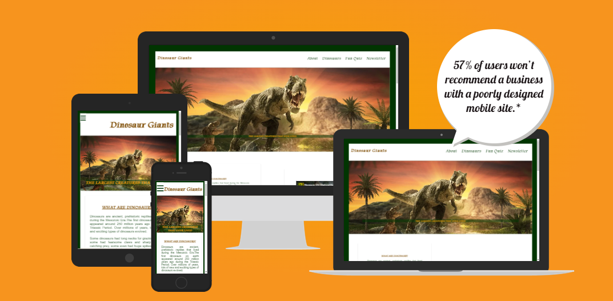
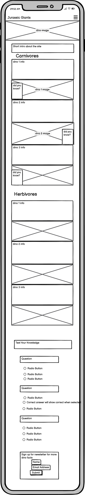
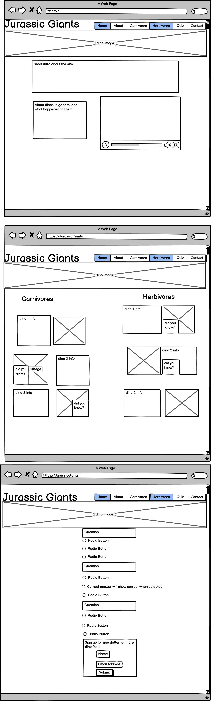
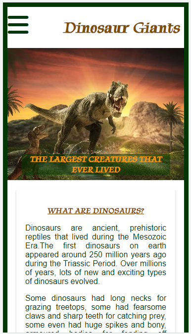
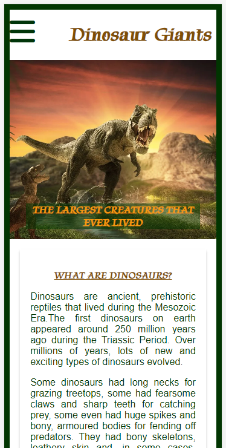
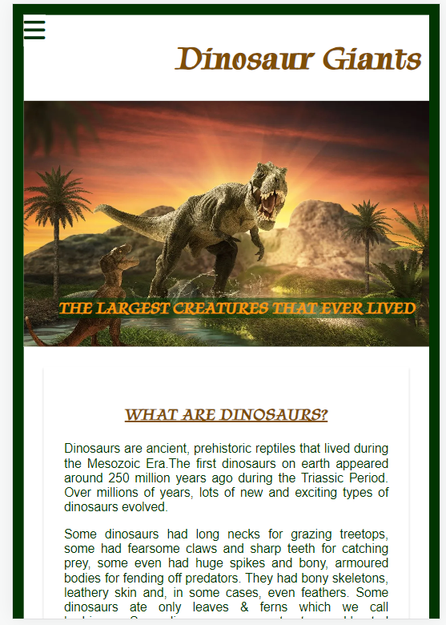
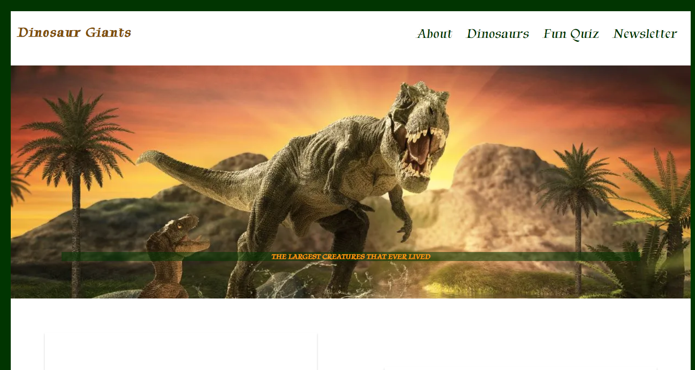
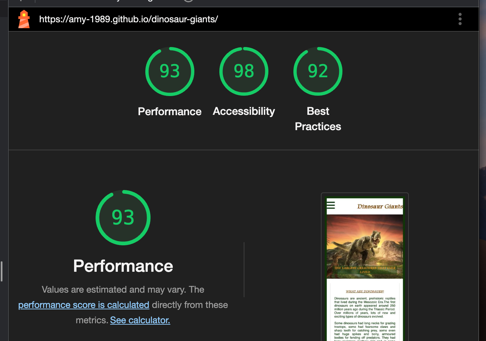
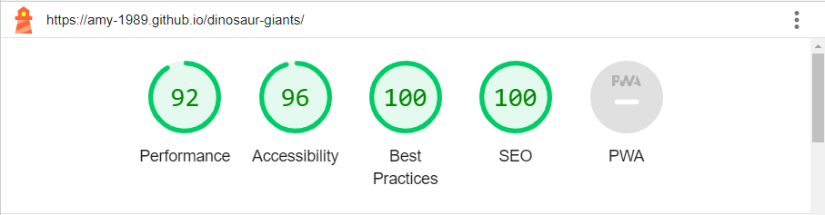
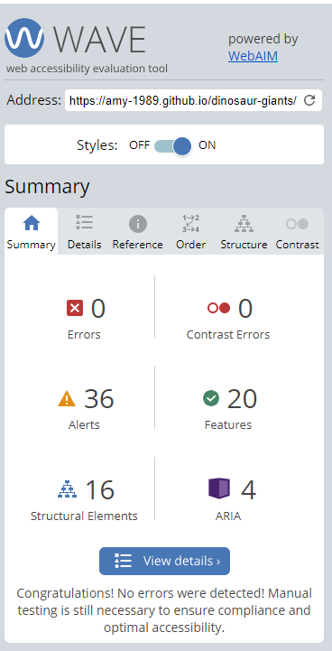

# Dinosaur Giants

This is a website designed for people of all ages, with an interest in learning about the largest dinosaurs of their time. It is designed with ease of use & accessibility in mind. It is responsive on many device sizes & is easy to navigate.

## User Experience

- User Stories
  
   - First time visitor Goals
     - As a first time visitor I want to learn about dinosaurs.
     - As a first time visitor I want to learn what dinosaurs are.
     - As a first time visitor I want to learn what kinds of dinosaurs are there.
     - As a first time visitor I want to easily navigate through the website to find content.
     - As a first time visitor I want to be able to see if the content and facts presented can be trusted. Are there any references or links to support the content.
     - As a first time visitor I want to see have they any social media presence.
     - As a first time visitor I want to see have they a contact page.
  
   - Returning Visitor Goals
     - As a returning visitor I want to find more information about dinosaurs.
     - As a returning visitor I want to find links to more facts about dinosaurs.
     - As a returning visitor I want to find detailed information about dinosaurs. What happened to them? What did they eat? How big were they?
     - As a returning visitor I want to find social media links to follow up for more information.
     - As a returning visitor I want to find contact information to ask any questions.
     - As a returning visitor I want to see is there a newsletter I can join or a blog I can follow.
  
   - Frequent Visitor Goals
     - As a frequent visitor I want to sign up to a newsletter so I can be kept abreast of any updates.
     - s a frequent visitor I want to check if there are any new dinosaur facts.
     - As a frequent visitor I want to check if there are any new content to interact with.

- Design
  
  - Colour Scheme
  
    The main colours used were green, white and orange. Monsido Color Contrast Checker was consulted to ensure enough contrast between background and foreground colour choices.
    
  - Typography 
  
    The Tapestry font and PT Serif font from Google Fonts is used throughout the site with Sans Serif as the fallback font. These fonts were chosen as a design choice in-keeping with the theme of the website and also because they are easy to read.
    
  - Imagery
  
    Imagery is very important in a site like this to support the written content. The hero image was chosen as it is exciting and enhances the chosen colour scheme for the site. All other image styles were chosen to compliment the hero image and colour scheme of the site.
    
- Wireframes
  
   - Mobile Wireframe  
   - Desktop Wireframe 

## Features

- Responsive on a range of devices.
- Interactive elements.

## Technologies Used

### Languages Used

- HTML5
- CSS

### Frameworks, Libraries & Programs Used

1. Google Fonts:
   - Google fonts were used to link the 'tapestry' & 'pt-serif' font into the .html files, which is used on all pages throughout the project.
  
2. Font Awesome:
   - Font Awesome was used to add icons to the footer on all pages for UX purposes & aesthetic design.

3. Git
   - Git was used for version control by utilizing the Gitpod terminal to commit to Git & push to GitHub.
  
4. GitHub
    - GitHub is used to store the projects code after being pushed from Git.

5. Balsamiq
   - Balsamiq was used to create the wireframes during the design process.

6. iStock
   - iStock was used to source all the images used in the project.

7. Monsido
   - Monsido Color Contrast Checker was used to ensure correct colour contrast for accessibility.

## Testing

The W3C Markup Validator and W3C CSS Validator Services were used to validate every page of the project to ensure there were no syntax errors.

- W3C Markup Validator 
- W3C CSS Validator 

### Testing User Stories from the User Experience (UX) Section

- First time visitor Goals

  - As a first time visitor I want to learn about dinosaurs.

    - Upon entering the site, users are greeted with an easily readable navigation bar with a clearly labelled 'About' section which will bring users directly to the first piece of information about dinosaurs.
    - This section is also conveniently located right below the hero image, so users can easily find the information without having to click the 'About' link.
    - The hero image was selected so users will know instantly that the website is about dinosaurs.

  - As a first time visitor I want to learn what dinosaurs are.

    - The landing page is divided into three main sections below the hero image. Each section clearly provides more detailed information about dinosaurs in a logical sequence.
    - There is also a short informational video about dinosaurs embedded on the landing page right below the hero image.
  
  - As a first time visitor I want to learn what kinds of dinosaurs are there.
  
    - The landing page has been designed with three paragraph sections detailing information about the dinosaurs.
    - There is a clearly labelled page link'Dinosaurs' in the navigation bar which allows users to go straight to more information about the different kinds of dinosaur.
    - There are links provided in the first paragraph below the hero image highlighted with a text underline, prompting users to click to find more detailed information.
    - There is a link in the navigation bar to a 'Fun Quiz' which users can interact with and test what they have learned.

  - As a first time visitor I want to easily navigate through the website to find content.

    - The site has been designed with ease of use in mind. At the top of every page there is a clearly labelled navigation bar with links to pages and sections clearly visible and accurately labelled.
    - After submitting the newsletter form, users are taken to a thank you page which opens in a new tab. This page also has the navigation bar across the top, providing users with the option of navigating from that page, rather than having to close the tab.
    - There are links provided in the about section to allow users to navigate to other sections without having to scroll back to the top of the page.

  - As a first time visitor I want to be able to see if the content and facts presented can be trusted. Are there any references or links to support the content.

    - There is an embedded youtube video provided on the landing page, made by the National Geographic, which supports the written content provided.

  - As a first time visitor I want to see have they any social media presence.

    - There are links to Facebook, Twitter & Youtube provided in the footer at the end of each page.
    - These links will all open in a new tab so users can easily find their way back to our site.

  - Returning Visitor Goals

    - As a returning visitor I want to find more information about dinosaurs.

      - Upon arrival to the site, users will find a navigation bar with a clearly labelled 'Dinosaurs' page link.
      - This link will bring visitors to a page dedicated to more in-depth detail about dinosaurs than the landing page.
      - The page is broken into two clearly defined sections, depending which kind of dinosaur the user wishes to know more about.
      - There are multiple images provided to support the content.

    - As a returning visitor I want to find contact information to ask any questions.

      - There are social media links to Facebook, Youtube & Twitter in the footer at the end of each page so users can get in touch if they wish.

  - Frequent Visitor Goals

    - As a returning visitor I want to see is there a newsletter I can join or a blog I can follow.

      - In the footer at the end of each page there is a sign up form for users to register if they wish to join our weekly newsletter.
      - There is also a clearly labelled 'Newsletter' link provided in the navigation bar at the top of each page.

    - As a frequent visitor I want to check if there are any new content to interact with.

      - By now the user is comfortable with our site and can easily follow any links provided to updated information in the future.

    - As a frequent visitor I want to check if there are any new quiz questions.

      - By now the user is familiar with our site and can easily navigate straight to the quiz page to check for any updates.

### Further Testing

- The website was tested on Google Chrome, Microsoft Edge, Safari and Mozilla Firefox browsers.
- The website was viewed on a variety of devices such as Desktop, Ipad, Iphone and Galaxy phones.
  Iphone SE 
  Samsung Galaxy 8+ 
  Ipad Air 
  Desktop 
- A number of testing was done to ensure that all links were working.
- Friends and family were asked to review the site on their own devices, and point out any bugs or issues.
- A peer review was undertaken among fellow CI students.
- The website was continuously tested throughout development using Chrome DevTools.
- The website was tested for Desktop and Mobile performance using Chrome DevTools Lighthouse.
  - Mobile Performance Results 
  - Desktop Performance Results 
- The site was tested for accessability using WAVE
  - WAVE Performance Results 

### Known Bugs

- On some mobile devices the navigation bar heading veers to the right. A margin-right of .5rem was added to fix this.
- On desktop browsers the transition style effect does not work on divs containing video or paragraphs.

## Deployment

### GitHub Pages

The project was deployed to GitHub Pages using the following steps...

Log in to GitHub and locate the GitHub Repository
At the top of the Repository (not top of page), locate the "Settings" Button on the menu.
Scroll down the Settings page until you locate the "GitHub Pages" Section.
Under "Source", click the dropdown called "None" and select "Main", then "Save".
The page will automatically refresh.
The now published site link  will be at the top of the "GitHub Pages" section.

### Forking the GitHub Repository

By forking the GitHub Repository we make a copy of the original repository on our GitHub account to view and/or make changes without affecting the original repository by using the following steps...

Log in to GitHub and locate the GitHub Repository
At the top of the Repository (not top of page) just above the "Settings" Button on the menu, locate the "Fork" Button.
You should now have a copy of the original repository in your GitHub account.

### Making a Local Clone

Log in to GitHub and locate the GitHub Repository
Under the repository name, click "Clone or download".
To clone the repository using HTTPS, under "Clone with HTTPS", copy the link.
Open Git Bash
Change the current working directory to the location where you want the cloned directory to be made.
Type git clone, and then paste the URL you copied in Step 3.
Press Enter. Your local clone will be created.

## Credits

### Code

- W3C Schools was used to learn more about dropdown navigation menus & card effects with CSS.
- This codepen by Robin Lloyd was used to help code the quiz section of the website .
- This codepen by Tobias Buchel was used to help code the navigation burger menu .
- This tutorial by LearnWebCode was used to help with further understanding of flexbox .
- Love Running project from Code Institute course was used to code the animation for hero image.
  
### Content

- All content was written by the developer.
- Various dinosaur facts were taken from the following books:
  - Dictionary of Dinosaurs by Dr Matthew G. Baron.
  - Dinosaur A-Z by Gill Davies.
  - Dinosaurs, a children's encyclopedia by Penguin Randomhouse.

### Media

- Copyright of the youtube video belongs to National Geographic.
- Hero Image and main images provided throughout the site were taken from iStock.
- Favicon image was taken from pngkey.

### Acknowledgements

- I would like to thank my mentor Narender for his invaluable support and insightful feedback during the development of the site.
- I would like to thank my fellow students on Slack for taking the time to talk through various issues throughout the development, in particular Angus Friel & Sarah-Lee, for their help resolving last minute bugs and lighthouse issues respectively.
- I would like to thank Tutor Support for their continued support and assistance.
